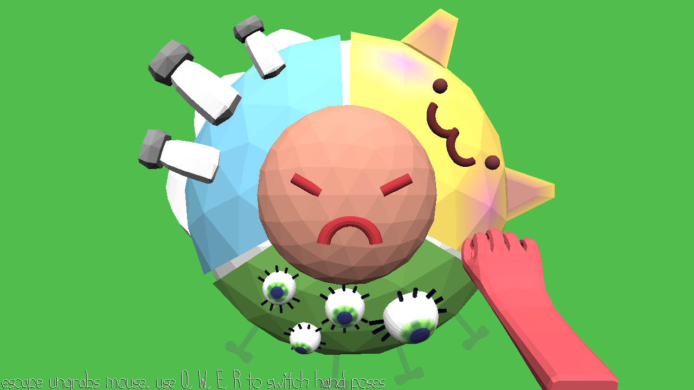

# Cat Pat

Author: Alyssa Lee

Design: Virtual bop-it. Switch between different hand movements and perform actions to the beat of the music! 

Screen Shot:

How To Play:
Press the Q, W, E, and R keys to switch your hand pose. On the beat, hit the corresponding part of the circle. You get more points for matching the music, and no points for using the wrong pose or hitting the wrong part of the circle. 

Sources: 
BG music is "City Sunshine" by Kevin MacLeod, found via [freepd.com](https://freepd.com/upbeat.php). 
"Cat, Screaming, A" SFX by InspectorJ, found via [freesound.org](https://freesound.org/people/InspectorJ/sounds/415209/)
"Cat Meow1" SFX by steffcaffrey, found via [freesound.org](https://freesound.org/people/steffcaffrey/sounds/262312/)
"shake" by SamsterBerdies, found via [freesound.org](https://freesound.org/people/SamsterBirdies/sounds/368607/)
"Glass Break" by unfa, found via [freesound.org](https://freesound.org/people/unfa/sounds/221528/)
"Thump 4" by jameswrowles, found via [freesound.org](https://freesound.org/people/jameswrowles/sounds/380638/)
"heavy punch" by damnsatinist, found via [freesound.org](https://freesound.org/people/damnsatinist/sounds/493913/)
"Boing.wav" by juskiddink, found via [freesound.org](https://freesound.org/people/juskiddink/sounds/140867/)
"Jew's Harp, Single, A (H4n).wav" by InspectorJ, found via [freesound.org](https://freesound.org/people/InspectorJ/sounds/411493/)
Text-to-speech "Q, W, E, R" audio downloaded from [text2speech.org](https://www.text2speech.org/)

This game was built with [NEST](NEST.md).

